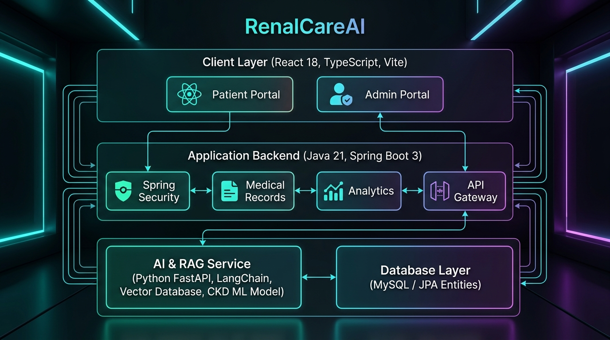
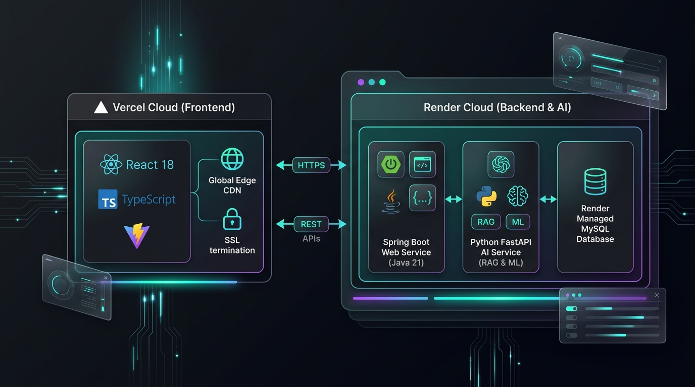

<!-- SLIDE 1: TRANG TIÊU ĐỀ -->
# 🫘 RenalCareAI
### Hệ Sinh Thái Trợ Lý AI Thông Minh Sàng Lọc, Phân Tích Chỉ Số & Quản Lý Sức Khỏe Bệnh Thận

<div class="highlight-box">
  <p><strong>Giải pháp tích hợp:</strong> Trí tuệ Nhân tạo (Machine Learning + RAG Y khoa) & Số hóa Hồ sơ Khám Y tế</p>
  <p><strong>Công nghệ chính:</strong> React 18, TypeScript, Spring Boot 3, Python FastAPI, Scikit-learn</p>
</div>

**Trình bày:** Nhóm Nghiên cứu & Phát triển Dự án  
**Thời gian:** 2026

---

<!-- SLIDE 2: ĐỘI NGŨ THÀNH VIÊN -->
# 👥 Đội Ngũ Phát Triển Dự Án

<div style="display: grid; grid-template-columns: repeat(3, 1fr); gap: 18px;">
<div class="highlight-box">
  <h3>1. Nguyễn Văn Quý</h3>
  <span class="badge">Trưởng Nhóm • Fullstack</span>
  <ul>
    <li>Kiến trúc Spring Boot & React.</li>
    <li>Bảo mật OTP Email & RBAC.</li>
    <li>Tích hợp Trợ lý RenalCareAI & Admin.</li>
  </ul>
</div>

<div class="highlight-box">
  <h3>2. Nguyễn Quốc Tiến</h3>
  <span class="badge" style="background:#8b5cf6;">AI & ML Engineer</span>
  <ul>
    <li>Nghiên cứu & huấn luyện mô hình ML.</li>
    <li>Xây dựng RAG Service & Vector DB.</li>
    <li>Trích xuất tri thức y khoa chuẩn mực.</li>
  </ul>
</div>

<div class="highlight-box">
  <h3>3. Trần Minh Chiến</h3>
  <span class="badge" style="background:#0284c7;">Frontend & Data</span>
  <ul>
    <li>Phát triển UI/UX React + TypeScript.</li>
    <li>Xây dựng pipeline OCR phiếu khám.</li>
    <li>Kiểm thử giao diện & trải nghiệm.</li>
  </ul>
</div>
</div>

---

<!-- SLIDE 3: BỐI CẢNH & TÍNH CẤP THIẾT -->
# 1. Bối Cảnh & Tính Cấp Thiết

### 🔴 Thực trạng Bệnh Thận:
- **Hơn 5 triệu người tại Việt Nam** và **10% dân số toàn cầu** đang mắc các bệnh lý về thận.
- Bệnh thường tiến triển **âm thầm ở giai đoạn đầu**, phần lớn chỉ phát hiện khi đã suy thận nặng.
- Người dân gặp rào cản lớn khi đọc các chỉ số xét nghiệm phức tạp (*eGFR, Creatinine, Protein niệu...*).

### ⚠️ Thách thức đối với người bệnh & y tế:
- Thiếu công cụ số hóa để **theo dõi diễn tiến liên tục** của chức năng thận.
- Dễ tiếp cận thông tin trôi nổi, ăn uống hoặc dùng thuốc sai lệch gây tổn thương thận nặng hơn.
- Hồ sơ khám giấy dễ thất lạc, khó tổng hợp đánh giá nguy cơ dài hạn.

---

<!-- SLIDE 4: MỤC TIÊU & GIẢI PHÁP TỔNG THỂ -->
# 2. Mục Tiêu & Giải Pháp Toàn Diện

<div style="display: grid; grid-template-columns: 1fr 1fr; gap: 20px;">
<div class="highlight-box">
  <h4>🎯 Mục Tiêu Dự Án</h4>
  <ul>
    <li>Phát hiện sớm nguy cơ bệnh thận dựa trên dữ liệu xét nghiệm.</li>
    <li>Cung cấp <strong>Trợ lý AI tư vấn 24/7</strong> dựa trên tri thức y khoa chuẩn mực.</li>
    <li>Số hóa và quản lý tập trung hồ sơ bệnh án cá nhân an toàn.</li>
  </ul>
</div>

<div class="highlight-box">
  <h4>💡 Giải Pháp RenalCareAI</h4>
  <ul>
    <li><strong>Trợ lý RenalCareAI:</strong> Trả lời triệu chứng, chế độ chăm sóc chuẩn y khoa.</li>
    <li><strong>Mô hình AI Phân Loại:</strong> Phân tầng 5 giai đoạn bệnh thận.</li>
    <li><strong>OCR Engine:</strong> Bóc tách chỉ số tự động từ ảnh / PDF kết quả khám.</li>
    <li><strong>Admin Portal:</strong> Giám sát và phân tích dữ liệu thời gian thực.</li>
  </ul>
</div>
</div>

---

<!-- SLIDE 5: KIẾN TRÚC HỆ THỐNG (SYSTEM ARCHITECTURE) -->
# 3. Kiến Trúc Tổng Thể Hệ Thống



---

<!-- SLIDE 6: MÔ HÌNH TRIỂN KHAI CLOUD (VERCEL & RENDER) -->
# 4. Mô Hình Triển Khai & Vận Hành Đám Mây



<div style="display: grid; grid-template-columns: repeat(3, 1fr); gap: 16px;">
<div class="highlight-box">
  <h4>▲ Vercel (Frontend)</h4>
  <ul>
    <li>React 18 + Vite SPA.</li>
    <li>Global Edge CDN siêu tốc.</li>
    <li>Tự động HTTPS & CI/CD.</li>
  </ul>
</div>

<div class="highlight-box">
  <h4>⚡ Render (Backend & AI)</h4>
  <ul>
    <li>Spring Boot & FastAPI.</li>
    <li>Web Services độc lập.</li>
    <li>Quản lý biến môi trường an toàn.</li>
  </ul>
</div>

<div class="highlight-box">
  <h4>🗄️ Render (MySQL Database)</h4>
  <ul>
    <li>Managed MySQL Database.</li>
    <li>Private Network độ trễ &lt; 2ms.</li>
    <li>Tự động sao lưu định kỳ.</li>
  </ul>
</div>
</div>

---

<!-- SLIDE 7: MÔ HÌNH MACHINE LEARNING DỰ ĐOÁN BỆNH THẬN -->
# 5. Mô Hình AI/ML Dự Đoán Bệnh Thận

### 📊 Dữ liệu & Chỉ số Sinh hóa cốt lõi:
- **Chức năng lọc thận:** Serum Creatinine ($mg/dL$), eGFR ($mL/min/1.73m^2$), Blood Urea ($mg/dL$).
- **Nước tiểu & Huyết học:** Albumin niệu, Tỷ trọng nước tiểu, Hồng cầu, Bạch cầu, Hemoglobin.
- **Tiền sử & Bệnh kèm:** Tăng huyết áp, Đái tháo đường, Phù chi, Chế độ ăn uống.

### 🧠 Thuật toán & Đánh giá Nguy cơ:
- Mô hình phân loại **Random Forest / Logistic Regression** tối ưu độ nhạy (*Sensitivity*).
- **Thang điểm Rủi ro (Risk Score 0-100):**
  - 🟢 **Nguy cơ Thấp (0-30 điểm):** Chức năng thận bình thường (Giai đoạn 1/2).
  - 🟡 **Nguy cơ Vừa (31-65 điểm):** Suy giảm vừa (Giai đoạn 3), cần can thiệp lối sống.
  - 🔴 **Nguy cơ Cao (66-100 điểm):** Suy thận tiến triển (Giai đoạn 4/5), cảnh báo khẩn cấp.

---

<!-- SLIDE 8: TRỢ LÝ RENALCAREAI -->
# 6. Trợ Lý AI RenalCareAI & Cơ Sở Tri Thức

<div style="display: grid; grid-template-columns: 1.2fr 0.8fr; gap: 20px;">
<div>
  <h3>🔍 Kiến trúc RAG (Retrieval-Augmented Generation):</h3>
  <ol>
    <li><strong>Tri thức Y khoa:</strong> Nạp tài liệu hướng dẫn lâm sàng chuẩn mực.</li>
    <li><strong>Vector Search:</strong> Chia đoạn, nhúng Vector Embeddings lưu trữ trong Vector Database.</li>
    <li><strong>Prompt Context Injection:</strong> Khi người dùng đặt câu hỏi, hệ thống truy xuất các đoạn tài liệu tương đồng nhất và đưa cho LLM tổng hợp câu trả lời chính xác, kèm nguồn trích dẫn.</li>
  </ol>
</div>

<div class="highlight-box">
  <h4>⭐ Lợi thế vượt trội:</h4>
  <ul>
    <li><strong>Tránh ảo giác</strong> thường gặp ở AI tổng quát.</li>
    <li><strong>Có trích dẫn nguồn y khoa</strong> minh bạch rõ ràng.</li>
    <li><strong>Cá nhân hóa tư vấn:</strong> Nhắc nhở ăn nhạt, giảm đạm, kiểm soát huyết áp.</li>
  </ul>
</div>
</div>

---

<!-- SLIDE 9: CÔNG NGHỆ OCR & PHÂN TÍCH HỒ SƠ Y TẾ -->
# 7. Công Nghệ OCR & Số Hóa Hồ Sơ Khám Bệnh

### 📄 Quy trình Xử lý Tự động Hồ sơ Xét nghiệm:

```
[Ảnh chụp / PDF Phiếu Khám] 
        ⬇️
[Trích xuất OCR / Vision AI] ➡️ Bóc tách Text từ bảng kết quả
        ⬇️
[Medical Entity Extraction] ➡️ Chuẩn hóa chỉ số (Creatinine, eGFR, BUN...)
        ⬇️
[ML Scoring & Y Tế Rules]   ➡️ Phân tầng giai đoạn bệnh thận & Tính điểm rủi ro
        ⬇️
[Lưu Hồ Sơ Khám & Xuất Báo Cáo] ➡️ Cung cấp khuyến nghị Dinh dưỡng & Tái khám
```

- **Độ chính xác cao:** Nhận diện và quy đổi đa dạng đơn vị y tế quốc tế ($µmol/L \leftrightarrow mg/dL$).
- **Bảo mật tuyệt đối:** Bắt buộc đăng nhập trước khi tải hồ sơ y tế.

---

<!-- SLIDE 10: CỔNG QUẢN TRỊ ADMIN PORTAL CHUYÊN NGHIỆP -->
# 8. Cổng Quản Trị Admin Portal Luxury Dark

<div style="display: grid; grid-template-columns: 1fr 1fr; gap: 16px;">
<div class="highlight-box">
  <h4>📊 Dashboard KPI Thời gian thực</h4>
  <ul>
    <li>Thống kê <strong>Unique Visitors</strong>, <strong>Pageviews</strong>, <strong>Lượt phản hồi Chatbox</strong>, <strong>Hồ sơ khám</strong>.</li>
    <li>Biểu đồ phân bổ mức độ rủi ro bệnh nhân (Cao / Vừa / Thấp).</li>
    <li>Nhật ký hoạt động hệ thống gần đây kèm phân trang 10 dòng/trang.</li>
  </ul>
</div>

<div class="highlight-box">
  <h4>📂 Quản lý Bệnh nhân & Hồ sơ (Dossier)</h4>
  <ul>
    <li>Tra cứu danh sách người dùng, trạng thái tài khoản.</li>
    <li><strong>Bệnh án tổng hợp (User Dossier):</strong> Vòng đo điểm nguy cơ, bảng chỉ số lâm sàng, khuyến nghị điều trị.</li>
    <li><strong>Lịch sử Chatbox:</strong> Đọc lại toàn bộ câu hỏi & câu trả lời AI đã tư vấn cho từng bệnh nhân.</li>
  </ul>
</div>
</div>

---

<!-- SLIDE 11: BẢO MẬT & QUY TRÌNH XÁC THỰC -->
# 9. Bảo Mật Dữ Liệu & Quy Trình Xác Thực

### 🛡️ Tiêu chuẩn Bảo mật Y tế & Người dùng:
1. **Xác thực Đăng ký 2 bước qua OTP Email:**
   - Đảm bảo 100% tài khoản người dùng gắn liền với email thật và đang hoạt động.
2. **Mã hóa Mật khẩu & Phiên làm việc:**
   - Áp dụng thuật toán băm **BCrypt**, bảo vệ phiên làm việc trên trình duyệt.
3. **Phân quyền Truy cập (Role-Based Access Control - RBAC):**
   - **Customer:** Chỉ truy cập hồ sơ cá nhân và khung chatbox.
   - **Admin:** Truy cập cổng quản trị điều hành, có xác thực bảo mật đa lớp.
4. **Kiểm soát Tải hồ sơ:**
   - Bắt buộc đăng nhập tài khoản trước khi nạp dữ liệu y tế nhạy cảm.

---

<!-- SLIDE 12: KẾT QUẢ ĐẠT ĐƯỢC & HƯỚNG PHÁT TRIỂN -->
# 10. Kết Quả Đạt Được & Hướng Phát Triển

<div style="display: grid; grid-template-columns: 1fr 1fr; gap: 20px;">
<div class="highlight-box">
  <h4>✅ Kết Quả Đạt Được</h4>
  <ul>
    <li>Hệ thống vận hành mượt mà, đồng bộ hoàn hảo giữa <strong>Frontend, Backend và AI RAG</strong>.</li>
    <li>Backend kiểm thử <strong>100% BUILD SUCCESS</strong>; Frontend <strong>0 lỗi lint/build</strong>.</li>
    <li>Tích hợp thành công mô hình ML dự đoán rủi ro bệnh thận và Trợ lý AI RenalCareAI.</li>
    <li>Giao diện hiện đại theo chuẩn Design System cao cấp.</li>
  </ul>
</div>

<div class="highlight-box">
  <h4>🚀 Hướng Phát Triển Tương Lai</h4>
  <ul>
    <li>Kết nối API với các thiết bị đo huyết áp / đường huyết thông minh (IoT).</li>
    <li>Mở rộng tích hợp hệ thống bệnh án điện tử bệnh viện (HIS / EMR).</li>
    <li>Phát triển ứng dụng di động đa nền tảng (Mobile App iOS & Android).</li>
  </ul>
</div>
</div>

---

<!-- SLIDE 12 (KẾT): LỜI CẢM ƠN & Q&A -->
# 👏 CẢM ƠN HỘI ĐỒNG & QUÝ KHÁCH!
### Hệ Thống Trợ Lý AI Chăm Sóc Sức Khỏe Thận — RenalCareAI

<div class="highlight-box" style="text-align: center; padding: 30px;">
  <h3>HỎI & ĐÁP (Q & A)</h3>
  <p>Chúng tôi rất sẵn lòng lắng nghe ý kiến đóng góp và giải đáp mọi câu hỏi.</p>
  <p><strong>🌐 Live Web:</strong> http://localhost:5173 &nbsp;|&nbsp; <strong>⚡ Backend:</strong> http://localhost:8080</p>
</div>
